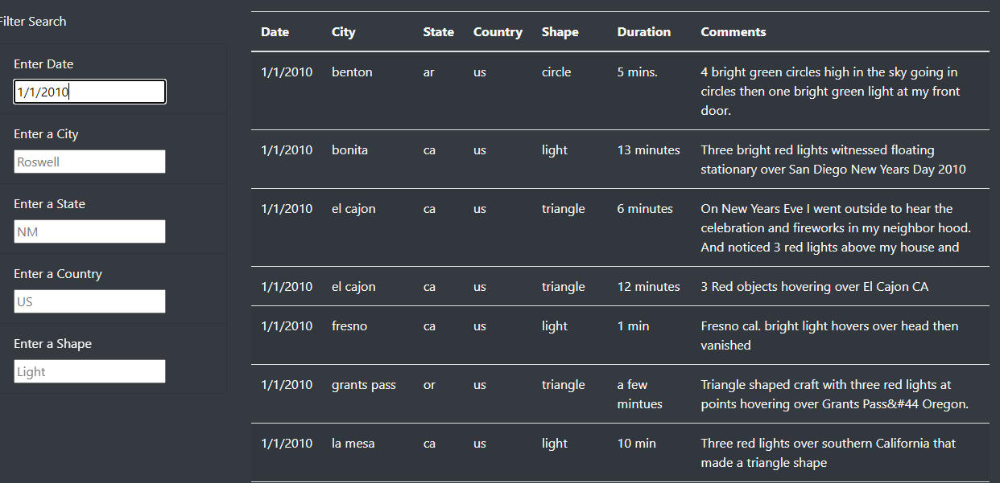

# Exploring What's Out There

## Overview of Project

We wanted to extend the ability for users to search our UFO sighting tables more specifically. Those specifics: city, state, country, and shape of sighting. The new filter table allows for the freeform searching of any or all of the parameters.

## Overview of the Results

Your new search table is now going to let your users find more specific sightings around them either by location or type of sighting. Previously, we were only able to search by date 

## Results

We have internally tested the system with a planned vacation in Japan. Our system is in full swing and ready for more testers.
The maps also list hotels and weather conditions of the city for our users to get real-time feedback of the city.

As we look to have more features added with the beta feedback, we want to have a second testing period ready.
